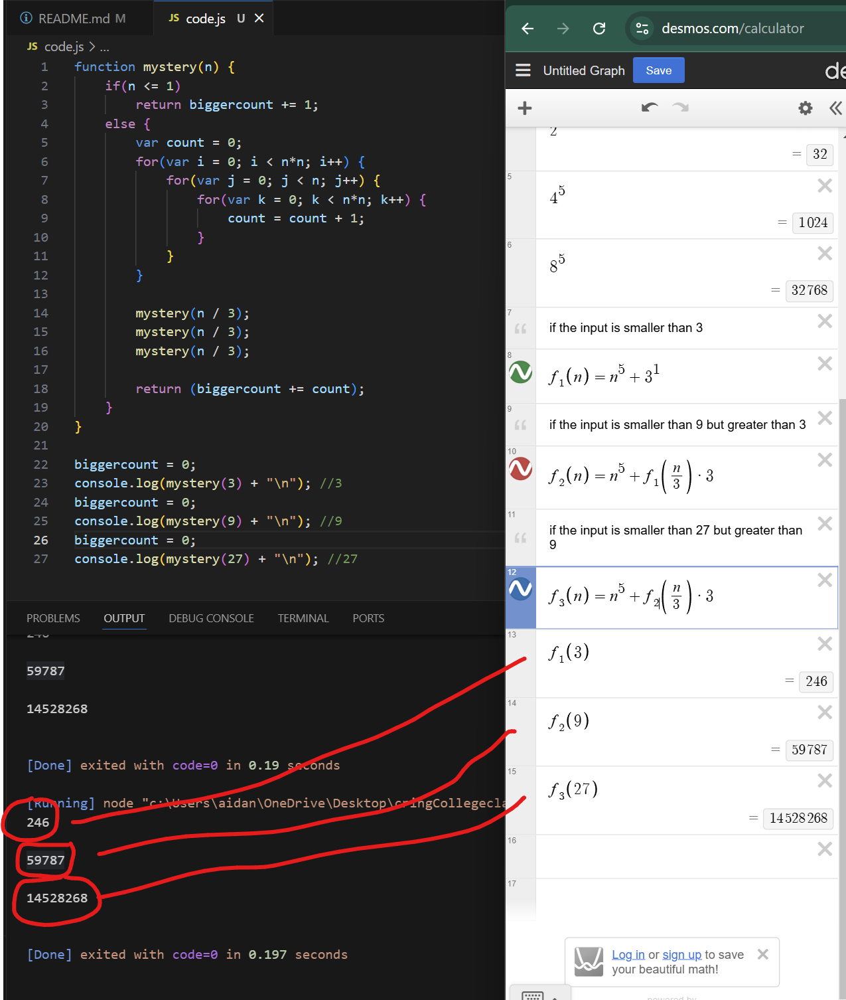
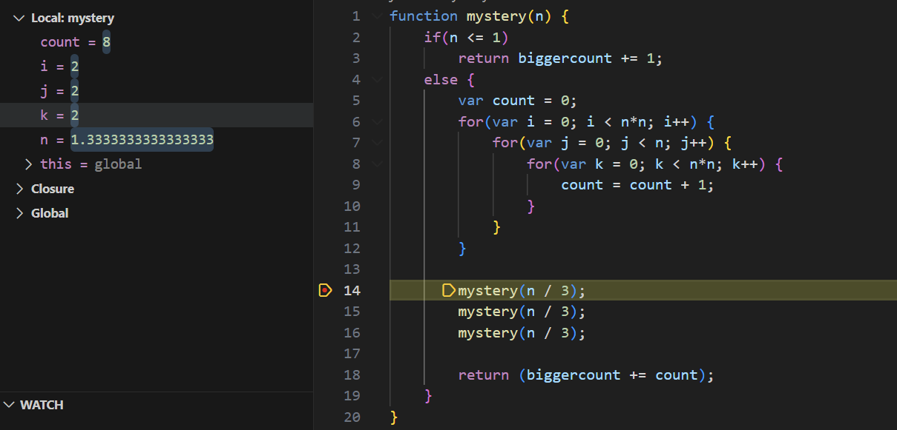
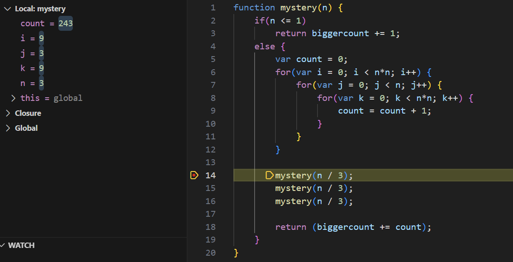

# Recurrence Analysis -- Mystery Function

Analyze the running time of the following recursive procedure as a function of
$n$ and find a tight big $O$ bound on the runtime for the function. You may
assume that each operation takes unit time. You do not need to provide a formal
proof, but you should show your work: at a minimum, show the recurrence relation
you derive for the runtime of the code, and then how you solved the recurrence
relation.

```javascript
function mystery(n) {
    if(n <= 1)
        return;
    else {
        mystery(n / 3);
        var count = 0;
        mystery(n / 3);
        for(var i = 0; i < n*n; i++) {
            for(var j = 0; j < n; j++) {
                for(var k = 0; k < n*n; k++) {
                    count = count + 1;
                }
            }
        }
        mystery(n / 3);
    }
}
```

Add your answer to this markdown file. [This
page](https://docs.github.com/en/get-started/writing-on-github/working-with-advanced-formatting/writing-mathematical-expressions)
might help with the notation for mathematical expressions.

my work:


The loop inside this function has a runtime of O(n^5), i know this is the case because at the bottom of the loop there is a built in incrementer by probing this incrementer i can see exactly how many times this loop was ran per input. The main part of the function ends up being n^5 but there is more, 3*(n/3)^5 is the ammount of extra times the n^5 loop runs at a third the input size so the function really ends up looking like this when drawn out:
Big O  = n^5 + (n/3)^5 + (n/3)^5 + (n/3)^5
taking the most significant factor we end up with O(n^5) being the asymtopic complexity.
the inputs 3, 9, and 27 are the worst case's because for each input under the size of 3^n has the same ammount of divisions. in the code if we input a 4, for example the loop would run 2 * 2 * 2 times which is less than n^5, this is why its a valid O(n) and not big Theta or even Omega. This picture shows the i, j, k variables which when multiplied together = the ammount of times we are looping. in this case because 4/3 = 1.333333 it is not the worst case.


This is what the worse case looks like:

in this image we have 9 * 3 * 9 because 9/3 = 3 and 3*3 * 3 * 3*3 is n^5.

That is why i used the inputs 3, 9, 27.

Recurance relation:
T(n) = 
{
    1 if n <= 1
    n^5 + 3*t(n/3)
}